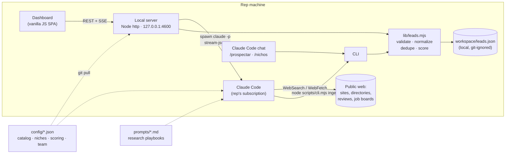
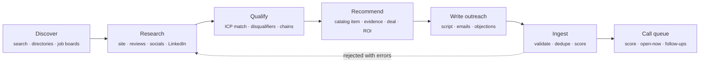

<div align="center">


# Devleck Lead Engine

**AI-powered B2B prospecting for the US market — from niche research to a ready-to-dial call list.**

Claude Code researches the web, verifies contact data, qualifies each business against a service catalog,
and writes the call script and emails. A local dashboard turns the result into a prioritized call queue for the sales team.

[](https://nodejs.org)
[](https://claude.com/claude-code)
[](package.json)
[](tests/)
[](#quick-start)

[Overview](#overview) · [Features](#features) · [Architecture](#architecture) · [Quick start](#quick-start) · [Configuration](#configuration) · [Lead pipeline](#the-lead-pipeline) · [Design decisions](#design-decisions)

</div>

---

## Overview

Cold outreach usually fails for two reasons: the list is wrong (businesses that can't or won't buy), and reps waste
their time researching instead of calling. **Devleck Lead Engine** fixes both.

You describe **what you sell** in a structured catalog. The engine finds US businesses that show **real, cited evidence**
of needing it. Examples: job posts for a front-desk role, reviews complaining about unanswered phones, a website stuck in 2017, a new location.
Each lead comes back with:

| | |
|---|---|
| 📞 **Verified contact data** | Phone numbers and emails, each with the URL where it was found and a confidence level (`verified` · `listed` · `pattern`) |
| 🎯 **What to sell and why** | The best-fit service from the catalog, the evidence behind it, a deal-size estimate and an ROI argument |
| 🗣️ **Ready-to-use outreach** | Call opener, discovery questions, objection handling, voicemail, first email and follow-up, all personalized to the business |
| 📊 **A consistent score** | 0–100 score and A/B/C tier computed from weighted sub-scores, plus the business's local time so reps call when someone answers |

The research runs on **each rep's own Claude subscription** through Claude Code's headless mode. There are no API keys,
no per-seat SaaS fees and no hosted backend to maintain.

## Features

**Prospecting**
- Targeted searches by niche, product, US states, cities, company size and buying signals (hiring, growth, reviews, website quality, funding, ads)
- Free-text niches beyond the curated list (e.g. *"bridal boutiques"*)
- Exclusion of national chains and of businesses already in the database or on the blocklist
- Incremental batch saving, so a long research session never loses work

**Market intelligence**
- `/nichos` researches US industry growth, pain and ability to pay (BLS, Census, industry reports, news), scores each niche 0–100 against the catalog and proposes new niches worth adding

**Sales workflow**
- **Call queue** ranked by score, *open-now* status in the lead's timezone, overdue follow-ups and attempt count
- One-click outcomes (*no answer, voicemail, gatekeeper, callback, meeting booked…*), each updating the pipeline status and scheduling the next touch
- `tel:` and `mailto:` actions with the subject and body prefilled and the rep's name and email injected into the copy
- On-demand **call prep**: re-researches a single lead (decision maker, direct line, recent news) and returns a one-screen call brief
- Notes, activity timeline, pipeline dashboard and CSV export

**Administration**
- Service catalog, niche priorities, scoring weights, sales territories and blocklist are versioned JSON, editable from the UI or through Claude
- Changes ship to the whole team with `git push`. Reps update from inside the app (fast-forward `git pull`)

## Architecture



The system has three layers:

1. **Reasoning: Claude Code.** Markdown playbooks in [`prompts/`](prompts/) define the research method: sources to combine,
   qualification rules, data-integrity rules, outreach guidelines and the exact output contract. The same playbook runs from the
   dashboard (headless `claude -p`) or from an interactive chat (custom slash commands in [`.claude/commands/`](.claude/commands/)).
2. **Integrity: a deterministic core.** The model never writes the database directly. Every batch goes through
   [`lib/leads.mjs`](lib/leads.mjs), which validates and normalizes it, rejects bad leads with actionable errors (the model then fixes them or drops the lead),
   merges duplicates without losing pipeline state, and computes the score.
3. **Operations: a local dashboard.** A dependency-free Node server streams the agent's progress over Server-Sent Events.
   It serves a single-page app built for one job: getting reps on the phone with the right business at the right time.

## Quick start

**Prerequisites:** [Node.js 18+](https://nodejs.org), [Git](https://git-scm.com) and [Claude Code](https://claude.com/claude-code) signed in to a Claude account.

```bash
git clone https://github.com/Kin9Zeus/Devleck-Lead-Engine.git
cd Devleck-Lead-Engine
npm run check      # verifies Node, Git, Claude Code and the configuration
npm start          # opens http://localhost:4600
```

There is no `npm install` step: the project has zero runtime dependencies. On Windows, double-clicking `iniciar.bat` does the same as `npm start`.

On first launch, open **Configuración**, pick your profile and territory, then go to **Prospectar** and launch a search.

### Running from the Claude Code chat

```text
/prospectar 10 custom jewelers in Texas and Florida, sell ai-jewelry-design-studio
/nichos which healthcare niches fit the AI Receptionist best right now
/preparar-llamada LMUYO4OR2JDP3
/nuevo-servicio AI tool for jewelers that models rings in 3D with Claude + Blender…
```

Leads created from the chat show up in the dashboard automatically.

## Configuration

Everything shared by the team lives in [`config/`](config/) and is distributed through git. Each rep's leads, notes and
settings stay in `workspace/`, which is git-ignored.

| File | Purpose |
|---|---|
| [`services.json`](config/services.json) | **Service and product catalog.** Ideal customer profile, buying signals, disqualifiers, pricing, ROI logic, pitch and objections. The model may only recommend active items. |
| [`niches.json`](config/niches.json) | Target niches with search keywords, signals, decision-maker titles, best call windows and a **1–5 priority** that shifts lead scores |
| [`scoring.json`](config/scoring.json) | Dimension weights, adjustments and tier thresholds |
| [`team.json`](config/team.json) | Reps and their state territories, so two reps don't call the same business |
| [`company.json`](config/company.json) | Positioning, differentiators, tone of voice, email signature and compliance footer |
| [`blocklist.json`](config/blocklist.json) | Current clients and do-not-contact businesses (matched by domain, phone or name) |

<details>
<summary><b>Example catalog entry</b></summary>

```jsonc
{
  "id": "ai-jewelry-design-studio",
  "type": "product",
  "name": "AI Jewelry Design Studio (Claude + Blender / AutoCAD)",
  "idealCustomer": { "niches": ["jewelry-stores"], "companySize": "1–30 employees", "description": "…" },
  "buyingSignals": ["Offers 'design your own ring'", "Job posts for CAD jewelry designer", "…"],
  "disqualifiers": ["Only resells mass-produced brand jewelry"],
  "pricing": { "model": "Setup + monthly", "from": 4000, "to": 15000, "currency": "USD" },
  "pitch": { "hook": "Your customer describes the ring, and in minutes you show them a photorealistic 3D render…" },
  "objections": [{ "objection": "We already have a CAD designer.", "response": "…" }]
}
```
</details>

## The lead pipeline



### Data integrity rules

The playbooks enforce these rules, and the ingest layer checks them:

- **Nothing is invented.** Every phone and email carries a source URL. Emails inferred from a pattern are flagged and ranked last.
- Phone numbers are validated against NANP rules and normalized to E.164 (`+15124821234`), with the extension preserved.
- Emails are syntax-checked, junk domains are filtered out, and generic inboxes (`info@`, `office@`) rank below personal ones.
- Leads that can't be reached, recommend an unknown or inactive service, or lack outreach copy are **rejected with field-level errors**. The agent fixes them or drops them.
- **Deduplication** by domain, phone and normalized name + city. Re-discovered leads are enriched, and their status, notes and history are kept.

### Scoring

The model rates five dimensions from 0 to 10 and must justify each rating with evidence. The server then computes the final score with the company's weights,
so scores stay comparable across reps and sessions:

| Dimension | Default weight | Question |
|---|---:|---|
| Fit | 30% | Does the business match the ideal customer profile of the recommended service? |
| Need | 25% | Is there concrete, cited evidence of the pain? |
| Reachability | 20% | Direct line and verified email, ideally of the decision maker? |
| Budget | 15% | Size, locations and industry ticket suggest they can pay |
| Timing | 10% | Recent trigger: hiring, expansion, funding |

Adjustments are applied on top: niche priority (±3 points per level), missing phone (−20), no verified email (−5), decision maker identified (+4) and direct line (+3).
The default tiers are **A ≥ 75** and **B ≥ 55**. Changing weights or niche priorities re-scores the whole database.

## Project structure

```text
├── .claude/
│   ├── commands/          # /prospectar · /nichos · /preparar-llamada · /nuevo-servicio
│   └── settings.json      # least-privilege tool permissions for the agent
├── config/                # shared, versioned business configuration (see above)
├── prompts/               # research playbooks: prospect.md · niches.md · call-prep.md
├── lib/
│   ├── leads.mjs          # validation, normalization, scoring, dedupe, ingest
│   ├── normalize.mjs      # phones (NANP/E.164), emails, domains, US states & timezones
│   └── store.mjs          # atomic JSON writes + cross-process file lock
├── scripts/cli.mjs        # the agent's only write path: brief · known · ingest · insights · stats · doctor
├── server/
│   ├── index.mjs          # REST API, SSE, static hosting, git-based updates
│   └── runner.mjs         # headless Claude Code runner and stream-json → event translation
├── ui/                    # dependency-free SPA (dashboard, queue, lead drawer, prospecting, niches, catalog)
├── tests/                 # node:test suite for the core
├── docs/GUIA-DEL-EQUIPO.md  # end-user guide for the sales team (Spanish)
└── CLAUDE.md              # project context loaded by Claude Code
```

## Design decisions

| Decision | Rationale |
|---|---|
| **Claude Code instead of the API** | Every rep already has a Claude subscription. Running the agent through `claude -p` removes API keys, usage billing and a hosted backend, and the same playbooks power both the chat and the dashboard. |
| **Prompts as versioned playbooks** | The research method is reviewable, diffable and improvable like code. One improvement to `prompts/prospect.md` raises lead quality for the whole team on the next `git pull`. |
| **Deterministic ingest layer** | LLM output is treated as untrusted input. Validation, normalization, dedupe and scoring live in tested code, and rejections return to the agent as actionable errors, which creates a self-correcting loop. |
| **Zero dependencies** | Reps aren't developers. Without `npm install`, there is no supply-chain surface and nothing breaks on a Node upgrade: clone and run. |
| **Local-first data** | Leads and notes never leave the rep's machine and never touch git. Only business configuration is shared. |
| **Atomic writes and a file lock** | The server and the agent's CLI write the same database concurrently. A lock based on `mkdir` plus temp-file rename prevents corruption, including on Windows. |
| **Least-privilege agent** | The agent may search, read, write in `workspace/` and run only `node scripts/cli.mjs`. The server binds to `127.0.0.1` and rejects foreign `Host` and `Origin` headers (DNS-rebinding protection). |

## Compliance

- Only **publicly listed business contact data** is collected, and each data point keeps its source.
- Generated emails include an opt-out line (**CAN-SPAM**). *Do not contact* outcomes plus the shared blocklist keep opt-outs honored across the team.
- Calls are designed to be placed manually by a rep, with no autodialers or prerecorded messages (**TCPA**).

## Development

```bash
npm test                      # core test suite (node:test)
npm run check                 # environment diagnostics
node scripts/cli.mjs help     # all CLI commands
PORT=4700 npm start           # run on another port
```

## Roadmap

- [ ] Optional shared lead registry (Supabase or Google Sheets) for cross-rep dedupe beyond territories
- [ ] CRM export (HubSpot / Pipedrive)
- [ ] Email-sending integration with tracked follow-up sequences
- [ ] Win/loss analytics fed back into niche priorities and scoring weights

---

<div align="center">

Built by **[Devleck](https://www.devleck.com/en)**, a software engineering studio for custom software, process automation and applied AI.

[devleck.com](https://www.devleck.com/en) · [Instagram](https://www.instagram.com/devleck.ia) · contact@devleck.com

</div>
